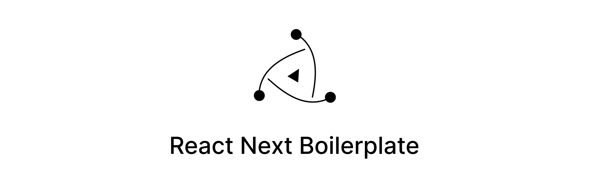

 

<strong>Start your project with the NextJS in seconds</strong>

We spend time using good community practices to make your project scalable.

 

  <!-- BUILD STATUS -->
  

  <!-- TEST COVERAGE -->
  

  <!-- QUALITY -->
  

  <!-- ISSUES -->
  
 
  <!-- MIT -->
  
  
  <!-- CONTRIBUTORS -->
  

  <!-- SPECTRUM -->
  

  <!-- TWITTER -->
  

  :rocket: A basis for reducing the configuration of your projects with <strong>Next.js</Strong>, best development practices and popular libraries in the developer community.

## Features

- [x] **redux-saga**: A library that aims to make application side effects (i.e. asynchronous things like data fetching and impure things like accessing the browser cache) easier to manage, more efficient to execute, easy to test, and better at handling failures.
- [x] **next-i18next**: A plugin for [Next.js](https://nextjs.org/) projects that allows you to get translations up and running quickly and easily, while fully supporting SSR, multiple namespaces with code splitting, etc.
- [x] **i18next**: An internationalization-framework written in and for JavaScript. But it's much more than that.
- [x] **redux**: A predictable state container for JavaScript apps.
- [x] **reselect**: Simple selector library for Redux (and others) inspired by getters in [NuclearJS](https://optimizely.github.io/nuclear-js/), subscriptions in re-frame and this proposal from speedskater.
- [x] **Immer**: (German for: always) is a tiny package that allows you to work with immutable state in a more convenient way. It is based on the copy-on-write mechanism
- [x] **@testing-library/react**: Simple and complete React DOM testing utilities that encourage good testing practices.
- [x] **SEO**: The advantages of this approach is to be able to create Rich User experiences in a uniform way, without compromising Search Engine Optimisation (SEO) factors that are key to good ranking on Google and other search engines.
- [x] **Typefaces**: Self-hosting is significantly faster. Loading a typeface from Google Fonts or other hosted font service adds an extra (blocking) network request.
- [x] **Emotion**: A library designed for writing css styles with JavaScript. It provides powerful and predictable style composition in addition to a great developer experience with features such as source maps, labels, and testing utilities.

# Getting Started

Welcome to the light documentation of React Next Boilerplate!

## System Requirements

- [Node.js](https://nodejs.org/en/) 10 or later
- MacOS, Windows (including WSL), and Linux are supported

## Setup

1. Clone this repo using `git clone --depth=1 https://github.com/react-next-boilerplate/react-next-boilerplate.git <YOUR_PROJECT_NAME>`
2. Move to the appropriate directory: `cd <YOUR_PROJECT_NAME>`.
3. Run `yarn` or `npm install` to install dependencies .
4. Run `yarn dev` or `npm run dev` to see the example app at `http://localhost:3000`.

These scripts refer to the different stages of developing an application:

- `dev` - Runs `next` which starts Next.js in development mode
- `build` - Runs `next` build which builds the application for production usage
- `start` - Runs `next` start which starts a Next.js production server

Now you're ready to rumble! :traffic_light:

## Documentation

- [Commands](./docs/general/commands.md): Getting the most out of this boilerplate

## [Demo](https://react-next-boilerplate.herokuapp.com/en)

## Code of Conduct

React Next Boilerplate is dedicated to building a welcoming, diverse, safe community. We expect everyone participating in the React Next Boilerplate community to abide by our [Code of Conduct](./CODE_OF_CONDUCT.md). Please read it. Please follow it. In the React Next Boilerplate community, we work hard to build each other up and create amazing things together.

## Contributing

Thank you for your interest in contributing; we are delighted you want to help out. We have a [contributing guide](./CONTRIBUTING.md) to help you get started.

## License

This project is licensed under the MIT license, Copyright (c) 2019 Jorge Luis Calleja Alvarado. For more information see [project license](./LICENSE).
